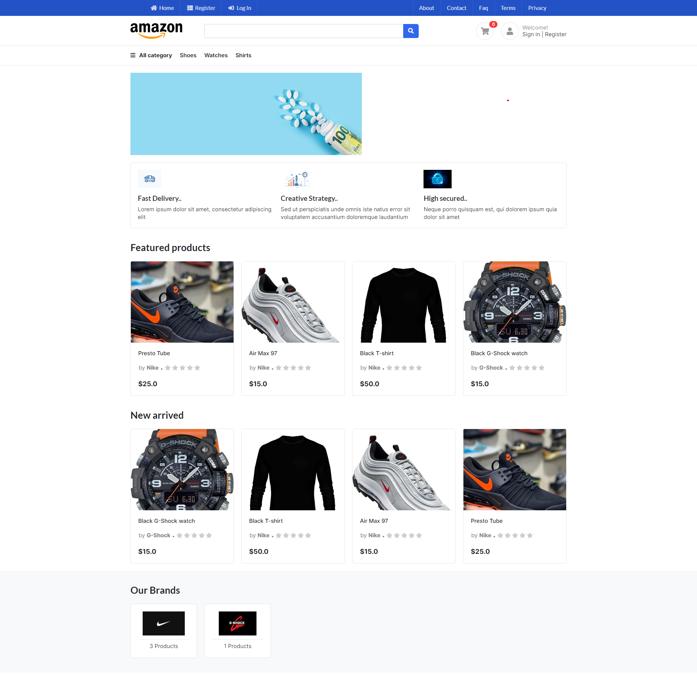

# Re-usable Flask Marketplace
[](https://circleci.com/gh/hack4impact/flask-base) [](https://waffle.io/hack4impact/flask-base)
[](https://codeclimate.com/github/hack4impact/flask-base/coverage)
[](https://codeclimate.com/github/hack4impact/flask-base)   


This Flask Marketplace application template boilerplate with code is built from Flask-base. **Documentation for flask-base is available at [http://hack4impact.github.io/flask-base](http://hack4impact.github.io/flask-base).**

## What's included?

* Blueprints
* User and permissions management
* Flask-SQLAlchemy for databases
* Flask-WTF for forms
* Flask-Assets for asset management and SCSS compilation
* Flask-Mail for sending emails
* gzip compression
* Redis Queue for handling asynchronous tasks
* ZXCVBN password strength checker
* CKEditor for editing pages

## Demos


Marketplace:




## Setting up

##### Clone the repo

```
$ git clone https://github.com/Anioko/re-usable-flask-marketplace.git
$ cd re-usable-flask-marketplace
```

##### Initialize a virtualenv

```
$ pip install virtualenv
$ virtualenv -p /path/to/python3.x/installation env
$ source env/bin/activate
```

For mac users it will most likely be
```
$ pip install virtualenv
$ virtualenv -p python3 env
$ source env/bin/activate
```
Note: if you are using a python2.x version, point the -p value towards your python2.x path

##### (If you're on a mac) Make sure xcode tools are installed

```
$ xcode-select --install
```

##### Add Environment Variables

Create a file called `config.env` that contains environment variables in the following syntax: `ENVIRONMENT_VARIABLE=value`.
You may also wrap values in double quotes like `ENVIRONMENT_VARIABLE="value with spaces"`.
For example, the mailing environment variables can be set as the following.
We recommend using Sendgrid for a mailing SMTP server, but anything else will work as well.

```
MAIL_USERNAME=SendgridUsername
MAIL_PASSWORD=SendgridPassword
SECRET_KEY=SuperRandomStringToBeUsedForEncryption
```

Other Key value pairs:

* `ADMIN_EMAIL`: set to the default email for your first admin account (default is `flask-base-admin@example.com`)
* `ADMIN_PASSWORD`: set to the default password for your first admin account (default is `password`)
* `DATABASE_URL`: set to a postgresql database url (default is `data-dev.sqlite`)
* `REDISTOGO_URL`: set to Redis To Go URL or any redis server url (default is `http://localhost:6379`)
* `RAYGUN_APIKEY`: api key for raygun (default is `None`)
* `FLASK_CONFIG`: can be `development`, `production`, `default`, `heroku`, `unix`, or `testing`. Most of the time you will use `development` or `production`.


**Note: do not include the `config.env` file in any commits. This should remain private.**

##### Install the dependencies

```
$ pip install -r requirements.txt
```

##### Other dependencies for running locally

You need [Redis](http://redis.io/), and [Sass](http://sass-lang.com/). Chances are, these commands will work:


**Sass:**

```
$ gem install sass
```

**Redis:**

_Mac (using [homebrew](http://brew.sh/)):_

```
$ brew install redis
```

_Linux:_

```
$ sudo apt-get install redis-server
```

You will also need to install **PostgresQL**

_Mac (using homebrew):_

```
brew install postgresql
```

_Linux (based on this [issue](https://github.com/hack4impact/flask-base/issues/96)):_

```
sudo apt-get install libpq-dev
```


##### Create the database

```
$ python manage.py recreate_db
```

##### Other setup (e.g. creating roles in database)

```
$ python manage.py setup_dev
```

Note that this will create an admin user with email and password specified by the `ADMIN_EMAIL` and `ADMIN_PASSWORD` config variables. If not specified, they are both `flask-base-admin@example.com` and `password` respectively.

##### [Optional] Add fake data to the database

```
$ python manage.py add_fake_data
```

## Running the app

```
$ source env/bin/activate
$ honcho start -f Local
```

For Windows users having issues with binding to a redis port locally, refer to [this issue](https://github.com/hack4impact/flask-base/issues/132).

## Formatting code

Before you submit changes to flask-base, you may want to autoformat your code with `python manage.py format`.

## Production

Remember to change the UPLOADED_IMAGES_DEST from 'C:/Users/user/mywebprojects/healthcareprofessionals/app/static/photo/' to a newly created folder on the servers.
Otherwise the images uploaded will not display.

##Todo

1. The POST feature doesn't clean against malicious couds, bleach needs to be used to clean() the codes before allowing the general public to use them the post feature.
Basically protect it against Cross-site Scripting XSS
